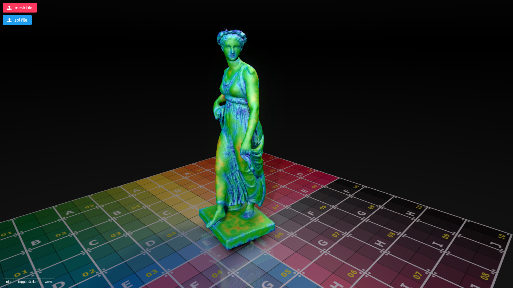

# online .mesh viewer
Visualisation de fichiers .mesh en ligne avec Blend4Web. L'application est visible sur le site [iscd.upmc.fr](http://iscd.upmc.fr/medit)

## Déploiement
Pour mettre cette application en ligne, il "suffit" de copier et d'extraire [le fichier .zip](https://github.com/ISCDdocs/onlineMeshViewer/releases) de "release" (déployé depuis le Project Manager de Blend4web) à l'emplacement voulu du serveur web.

Il est aussi possible d'utiliser le fichier localement sur son ordinateur en ouvrant simplement le fichier .html avec un navigateur.

Pour le site iscd.upmc.fr, se référer à [la page correpondante](https://iscddocs.github.io/docs/iscdupmc/applis3D.html) 

## Développement

### Resources
* [B4W website](https://www.blend4web.com/en/)
* [Project Manager documentation](https://www.blend4web.com/doc/en/project_manager.html)
* [Project Manager QuickStart](https://www.blend4web.com/en/community/article/341/)
* [Application development documentation](https://www.blend4web.com/doc/en/developers.html)
* [API documentation](https://www.blend4web.com/api_doc/index.html)

### Utilisation du Project Manager
Les deux principaux fichiers sont [MeshViewer.js](MeshViewer.js) (correspondant à l'application Javascript/Blend4Web) et [MeshViewer.html](MeshViewer.html) (correspondant à la page web qui sera visible et appelera le script Javascript).

Pour modifier le projet, il est nécessaire de passer par le [Project Manager de Blend4Web](https://www.blend4web.com/en/community/article/341/).

Pour importer le projet sur une autre installation de Blend4Web, utiliser la fonctionnalité "import project". 

Une fois la version développement fonctionnelle, **build project** puis **deploy project** permettent théoriquement d'obtenir un nouveau fichier .zip, prêt à être déployé.

**Note:** Il arrive que l'application ne se charge pas, si l'erreur est "b4w undefined", il faudra changer dans le fichier **.html** l'emplacement du script b4w.min.js, pour le mettre avant le chargement du script **MeshViewer.js**.
